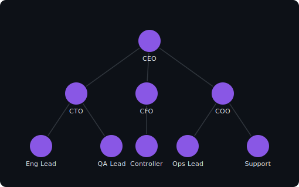
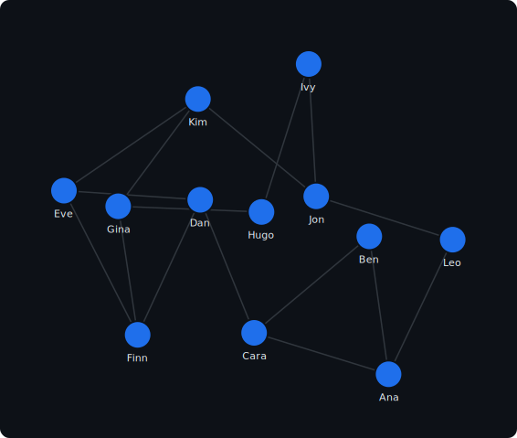
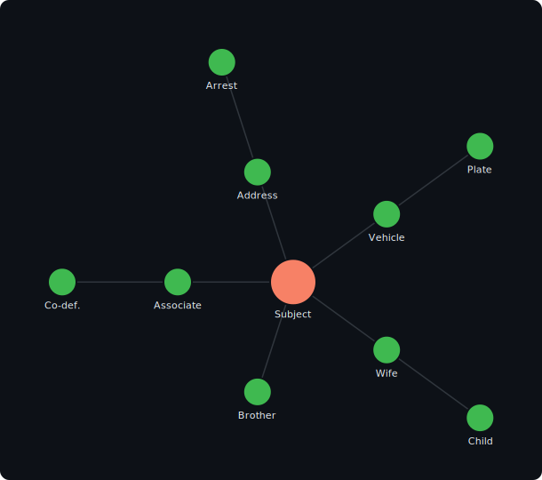

# GraphJS
[](https://www.npmjs.com/package/graphjs)
[](https://img.shields.io/github/v/release/marcmouries/Graphjs?include_prereleases)


GraphJS is a framework for easily representing and displaying graphs in JavaScript. 

## Objective

Very easy to use.

```JavaScript
import { Graph, ForceDirected } from "graphjs";

// Load a graph from JSON ({ nodes, links } or { nodes, edges })
const graph = new Graph();
graph.loadJSON({
  nodes: [{ id: "a" }, { id: "b" }, { id: "c" }],
  edges: [{ source: "a", target: "b" }, { source: "b", target: "c" }],
});

// Lay it out with the force-directed simulation
const layout = new ForceDirected(graph, { center: { x: 400, y: 300 } });
layout.on("tick", () => { /* nodes have updated x / y — draw them */ });
layout.on("end",  () => { /* simulation settled */ });
layout.start();
```

## Layouts

<table>
  <thead>
    <tr><th>Org Chart — <code>TreeLayout</code></th><th>Force-Directed — <code>ForceDirected</code></th><th>Radial — <code>RadialLayout</code></th></tr>
  </thead>
  <tbody>
    <tr>
      <td></td>
      <td></td>
      <td></td>
    </tr>
  </tbody>
</table>

## Examples

The images above are produced by the scripts in [`examples/`](examples/). Each builds a graph,
runs a layout, and renders an SVG (see [`examples/render.js`](examples/render.js) for the tiny
headless SVG renderer):

| Example | Layout |
|---------|--------|
| [`examples/org-chart.js`](examples/org-chart.js) | `TreeLayout` (Walker's algorithm) |
| [`examples/force-directed.js`](examples/force-directed.js) | `ForceDirected` |
| [`examples/radial.js`](examples/radial.js) | `RadialLayout` |

Regenerate all of them with:

```bash
bun run examples        # writes examples/img/*.svg
```

## Development

GraphJS is bundled with [Bun](https://bun.sh) (no Rollup/Webpack). The source is native ES modules.

```bash
bun install        # install dev tooling (nothing external is required to build)
bun run build      # produce dist/esm, dist/cjs and dist/umd bundles
bun test           # run the test suite
bun run dev        # rebuild the ESM bundle on change (watch mode)
```

### Build outputs

| Field     | File                        | Format |
|-----------|-----------------------------|--------|
| `module`  | `dist/esm/index.js`         | ESM (`import`) |
| `main`    | `dist/cjs/index.cjs`        | CommonJS (`require`) |
| `browser` | `dist/umd/graphjs.min.js`   | IIFE — exposes `window.graphjs` |

Build artifacts under `dist/` are generated on demand (and on `prepublishOnly`); they are not
committed. For a `<script>` tag, load the UMD bundle and use the `graphjs` global:

```html
<script src="dist/umd/graphjs.min.js"></script>
<script>
  const graph = new graphjs.Graph();
  const layout = new graphjs.ForceDirected(graph, { center: { x: 400, y: 300 } });
</script>
```
